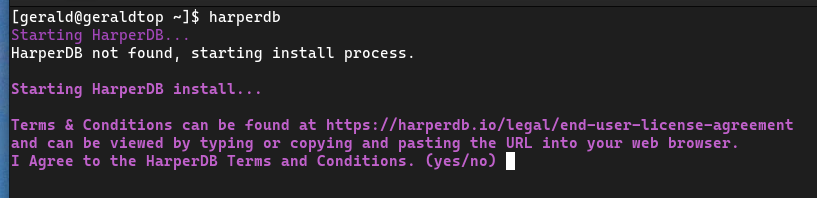
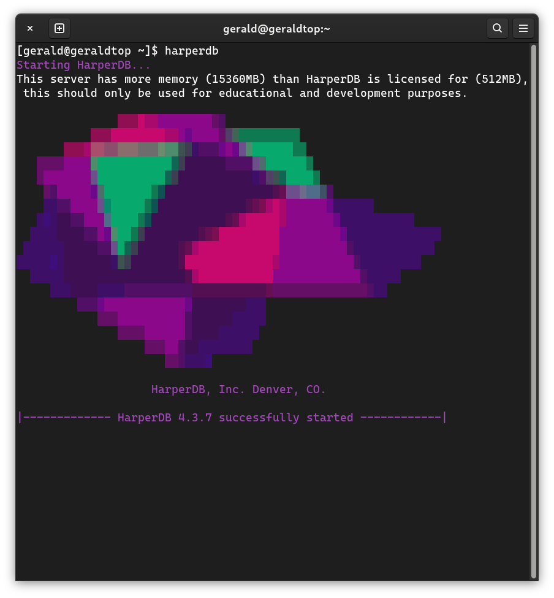

## Setup and configuration

The following commands are used for setup:

### CLI setup

```
#minimum required parameters for no additional CLI prompts
export TC_AGREEMENT=yes
export HDB_ADMIN_USERNAME=HDB_ADMIN
export HDB_ADMIN_PASSWORD=password
export ROOTPATH=/tmp/hdb/
export OPERATIONSAPI_NETWORK_PORT=9925
harperdb install
```

These commands and environment variables could be used as follows:

### Right after installation

```
$ npm install -g harperdb
$ harperdb start \
  --TC_AGREEMENT "yes" \
  --ROOTPATH "/home/ubuntu/hdb" \
  --OPERATIONSAPI_NETWORK_PORT "9925" \
  --HDB_ADMIN_USERNAME "HDB_ADMIN" \
  --HDB_ADMIN_PASSWORD "password"
```

### Interactive installation:

There is another method we can use after installing harperdb.

1. Execute ``harperdb``
2. We will now look at this prompt:



After accepting the terms and conditions we'll see this prompt:



For configuration we could use [envoriment variables](./variables-de-env-archivos.md) or configure using yaml files. For this exposition we'll use configuration throught yaml files.

## Configuration

HarperDB is configured through a YAML file called ``harperdb-config.yaml`` located in the HarperDB root directory, by default this is a directory named hdb located in the home directory of the current user.

### File basic configuration

**Note:** the configuration elements in harperdb-config.yaml use camelcase: **operationsApi**.

To change a configuration value edit the harperdb-config.yaml file and save any changes. HarperDB must be restarted for changes to take effect.

## Importing configuration

To use a custom configuration file to set values on install, use the CLI/ENV variable HDB_CONFIG and set it to the path of your custom configuration file.

To install HarperDB overtop of an existing configuration file, set HDB_CONFIG to the root path of your install ``<ROOTPATH>/harperdb-config.yaml``

