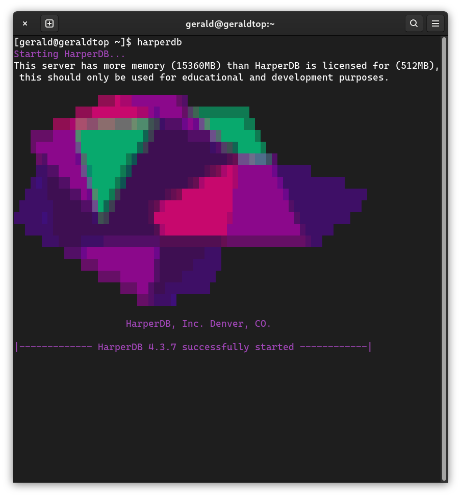

## Setup and configuration

The following commands are used for setup:

### CLI setup

```
#minimum required parameters for no additional CLI prompts
export TC_AGREEMENT=yes
export HDB_ADMIN_USERNAME=HDB_ADMIN
export HDB_ADMIN_PASSWORD=password
export ROOTPATH=/tmp/hdb/
export OPERATIONSAPI_NETWORK_PORT=9925
harperdb install
```

These commands and environment variables could be used as follows:

### Right after installation

```
$ npm install -g harperdb
$ harperdb start \
  --TC_AGREEMENT "yes" \
  --ROOTPATH "/home/ubuntu/hdb" \
  --OPERATIONSAPI_NETWORK_PORT "9925" \
  --HDB_ADMIN_USERNAME "HDB_ADMIN" \
  --HDB_ADMIN_PASSWORD "password"
```

### Interactive installation:

There is another method we can use after installing harperdb.

1. Execute ``harperdb``
2. We will now look at this prompt:


After accepting the terms and conditions we'll see this prompt:



For configuration we could use **envoriment variables** or configure throught yaml files. For this exposition we'll use configuration throught yaml files.

The configuration file is localted in ``~/hdb/``, the file is named ``harperdb-config.yam``.