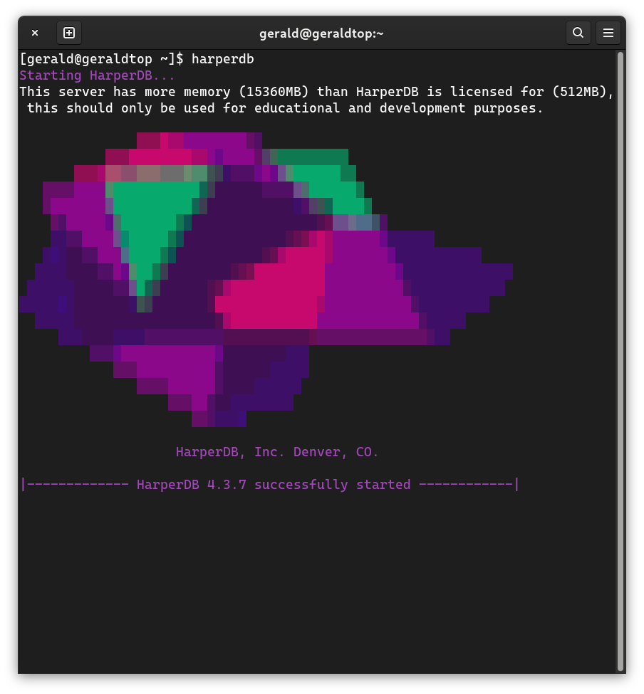

## Configuración e instalación

Los siguientes comandos se utilizan para la configuración:

### Configuración de la interfaz de línea de comandos (CLI)

```
#parámetros mínimos requeridos para no tener más indicaciones en la CLI
export TC_AGREEMENT=yes
export HDB_ADMIN_USERNAME=HDB_ADMIN
export HDB_ADMIN_PASSWORD=password
export ROOTPATH=/tmp/hdb/
export OPERATIONSAPI_NETWORK_PORT=9925
harperdb install
```

Estos comandos y variables de entorno se pueden utilizar de la siguiente manera:

### Justo después de la instalación

```
$ npm install -g harperdb
$ harperdb start \
  --TC_AGREEMENT "yes" \
  --ROOTPATH "/home/ubuntu/hdb" \
  --OPERATIONSAPI_NETWORK_PORT "9925" \
  --HDB_ADMIN_USERNAME "HDB_ADMIN" \
  --HDB_ADMIN_PASSWORD "password"
```

### Instalación interactiva:

Existe otro método que podemos utilizar después de instalar harperdb.

1. Ejecuta ``harperdb``
2. Ahora veremos este indicador:


Después de aceptar los términos y condiciones, veremos este indicador:



Para la configuración, podríamos usar [variables de entorno](./variables-de-env-archivos.md) o configurar usando archivos yaml. Para esta exposición, usaremos la configuración a través de archivos yaml.

## Configuración

HarperDB se configura a través de un archivo YAML llamado ``harperdb-config.yaml`` ubicado en el directorio raíz de HarperDB, por defecto este es un directorio llamado hdb ubicado en el directorio home del usuario actual.

### Configuración básica del archivo

**Nota:** los elementos de configuración en harperdb-config.yaml utilizan camelcase: **operationsApi**.

Para cambiar un valor de configuración, edita el archivo harperdb-config.yaml y guarda cualquier cambio. HarperDB debe ser reiniciado para que los cambios surtan efecto.

## Importando configuración

Para usar un archivo de configuración personalizado para establecer valores en la instalación, usa la variable CLI/ENV HDB_CONFIG y configúrala en la ruta de tu archivo de configuración personalizado.

Para instalar HarperDB encima de un archivo de configuración existente, configura HDB_CONFIG en la ruta raíz de tu instalación ``<ROOTPATH>/harperdb-config.yaml``.