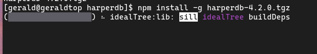

# Procedimiento de instalación
Vamos a realizar una instalación mediante compilación binaria:

Primero, necesitamos descargar el paquete [paquete de instalación](https://products-harperdb-io.s3.us-east-2.amazonaws.com/index.html)

**Nota:** si queremos compilar desde el código fuente, necesitamos las siguientes dependencias:

- Go: versión 1.19.1
- GCC
- Make
- Python v3.7, v3.8, v3.9, o v3.10

Después de descargar el paquete, necesitamos ejecutar: 

``npm install -g harperdb-X.X.X.tgz harperdb install``

**Pasos para la instalación:**
1. En la terminal del sistema, vamos al directorio donde se encuentra el paquete de instalación de HarperDB.

    ``[geralduwu@geraldtop harperdb]$ ls``\
    ``harperdb-4.2.0.tgz``

**Nota:** es obligatorio tener instalado NodeJS para instalar HarperDB.

2. Comenzamos la instalación:

    ``[geralduwu@geraldtop harperdb]$ npm install -g harperdb-4.2.0.tgz``

3. Después de la instalación veríamos un indicador como este:
   
    ``added 1 package in 1m``

4. Después de la instalación, podemos iniciar HarperDB ejecutando este comando: ``harperdb`` o ``harperdb start``